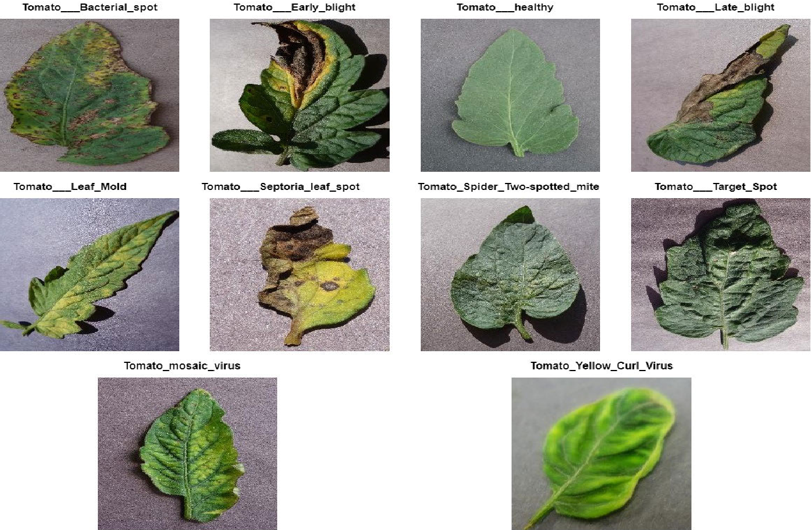

# Plant_Leaf_Diseases_Classification

This study applies machine learning and image processing to classify plant leaf diseases by extracting color, texture, and shape features. A Support Vector Machine (SVM) model achieved 98.23% accuracy through hold-out validation. The results highlight the SVM’s effectiveness in disease classification, promoting sustainable agriculture through technological innovation.

Link to the Dataset: https://data.mendeley.com/datasets/tywbtsjrjv/1

